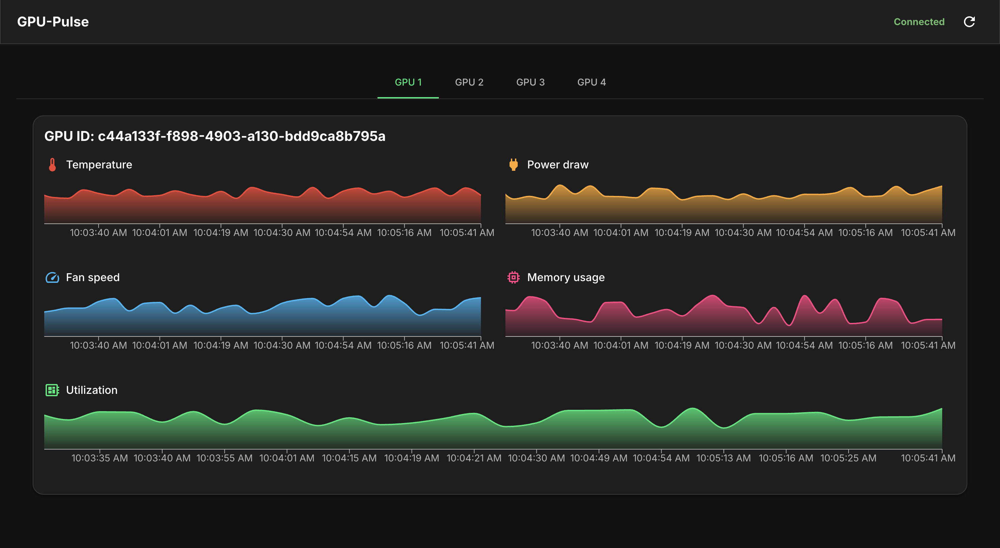
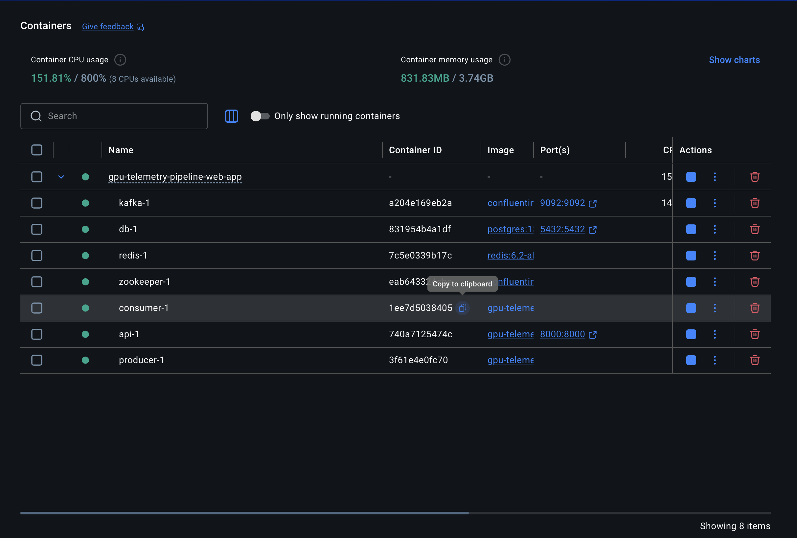

# 📈 GPU Telemetry Pipeline & Real-Time Dashboard

This project provides a complete, end-to-end solution for monitoring GPU telemetry data in real-time. It features a scalable data pipeline, a persistent storage layer, and a dynamic web-based frontend for visualization. The entire application is containerized using Docker for seamless deployment.



## 🎯 The Problem Statement

In many modern computing environments, such as machine learning clusters, scientific computing grids, or large-scale data centers, multiple GPUs are often running in parallel across different machines. Effectively monitoring the performance and health of these distributed resources is critical for:

-   **Resource Management**: Ensuring that GPUs are being utilized efficiently and not sitting idle.
-   **Proactive Maintenance**: Detecting anomalies like overheating or excessive power draw before they lead to hardware failure.
-   **Performance Tuning**: Understanding how different workloads impact GPU performance to optimize resource allocation.
-   **Cost-Benefit Analysis**: Tracking utilization to make informed decisions about scaling infrastructure up or down.

This project aims to solve this problem by providing a centralized, real-time dashboard that offers a clear and immediate view into the operational status of every monitored GPU.

## ✨ Key Features

-   **Real-Time Streaming**: Utilizes WebSockets for a live, low-latency feed of GPU metrics directly to the browser.
-   **Scalable Data Pipeline**: Built with Kafka, a distributed streaming platform, to handle high volumes of telemetry data from numerous sources.
-   **Rich Visualization**: The frontend dashboard, built with React and Recharts, displays key metrics like temperature, power draw, utilization, fan speed, and memory usage in clear, interactive charts.
-   **Persistent Storage**: Telemetry data is stored in a PostgreSQL database, allowing for historical analysis and long-term record-keeping.
-   **Decoupled & Asynchronous**: The system is composed of decoupled microservices that communicate asynchronously via a message bus (Kafka and Redis), ensuring resilience and scalability.
-   **Containerized**: The entire application stack is defined in Docker Compose, allowing for a one-command setup.

## 🏗️ High-Level Architecture

The system is split into two main parts: a backend data pipeline and a frontend dashboard.

### Backend Architecture

The backend follows a producer-consumer pattern. A `producer` service simulates GPU sensors and publishes data to a Kafka topic. A `consumer` service reads from Kafka, persists the data to a PostgreSQL database, and simultaneously publishes it to a Redis pub/sub channel. A FastAPI web server subscribes to the Redis channel and pushes the live data to all connected WebSocket clients.


### Frontend Architecture

The frontend is a React-based single-page application (SPA). It establishes a WebSocket connection to the backend, listens for incoming telemetry data, and manages the state for multiple GPUs. It uses Material-UI for UI components and Recharts for rendering the time-series charts.


## 📚 In-Depth Documentation

For a more granular explanation of the system design, technology choices, and architectural tradeoffs, please refer to the detailed documentation for each part of the application:

-   [**Backend System Design**](./backend/SYSTEM_DESIGN.md)
-   [**Frontend System Design**](./frontend/SYSTEM_DESIGN.md)

## 🛠️ Technology Stack & Rationale

#### Backend
-   **Python**: Chosen for its extensive data science ecosystem and robust web frameworks.
-   **FastAPI**: A modern, high-performance web framework used to build the API and WebSocket endpoints. Its asynchronous capabilities are perfect for real-time applications.
-   **PostgreSQL**: A powerful, open-source relational database used for persistently storing all telemetry data.
-   **SQLAlchemy**: The Python SQL toolkit and Object Relational Mapper (ORM) used to interact with the PostgreSQL database in a Python-native way.

#### Frontend
-   **React**: A declarative JavaScript library for building component-based user interfaces. Ideal for creating a dynamic, single-page application.
-   **Material-UI (MUI)**: A popular React UI framework that provides a suite of well-designed components, accelerating development and ensuring a clean user experience.
-   **Recharts**: A composable charting library built for React, used to render the time-series data visualizations.

#### Messaging & Streaming
-   **Apache Kafka**: A distributed event streaming platform used as the primary message bus. It is designed for high-throughput, fault-tolerant data ingestion, making it suitable for collecting telemetry from many sources.
-   **Redis**: An in-memory data store used here as a pub/sub message broker. It provides a lightweight and extremely fast way to broadcast messages from the backend consumer to the API server, which then forwards them to clients via WebSockets.

#### DevOps & Deployment
-   **Docker & Docker Compose**: Used to containerize every service in the application. This ensures a consistent and reproducible environment for development and deployment, simplifying setup to a single command.


## 🚀 Getting Started

### Prerequisites

-   [Docker](https://www.docker.com/get-started)
-   [Docker Compose](https://docs.docker.com/compose/install/)

### Running the Application

The application is composed of two main parts that need to be run separately: the backend services (run via Docker Compose) and the frontend development server.

1.  **Start the Backend Services:**

    From the root of the project, run the following command. This will start the database, Kafka, Redis, and all the Python services.
    ```bash
    docker-compose up --build -d
    ```
    After running the command, you should see all the services running successfully in your Docker dashboard or by running `docker ps`:

    

2.  **Start the Frontend Application:**

    In a separate terminal, navigate to the `frontend` directory and start the React development server.
    ```bash
    cd frontend
    npm install
    npm start
    ```

3.  **Access the Dashboard:**

    Once the frontend server is running, open your web browser and navigate to:
    **http://localhost:3000**

    You should see the GPU Telemetry Dashboard, with real-time data streaming in.

### Stopping the Application

To stop all the running containers, use the following command:

```bash
docker-compose down
```
